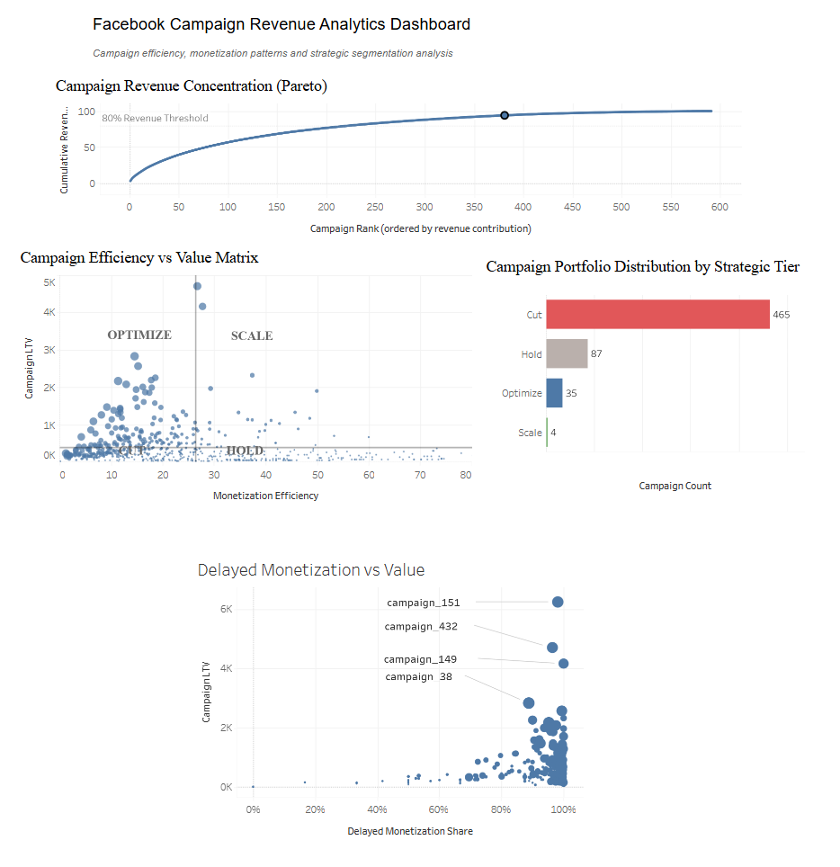
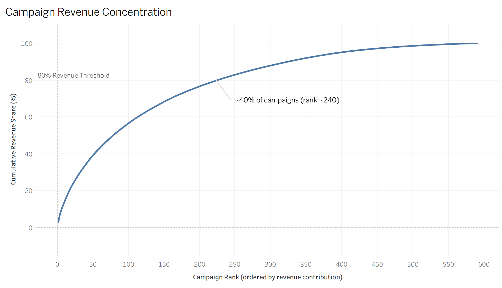
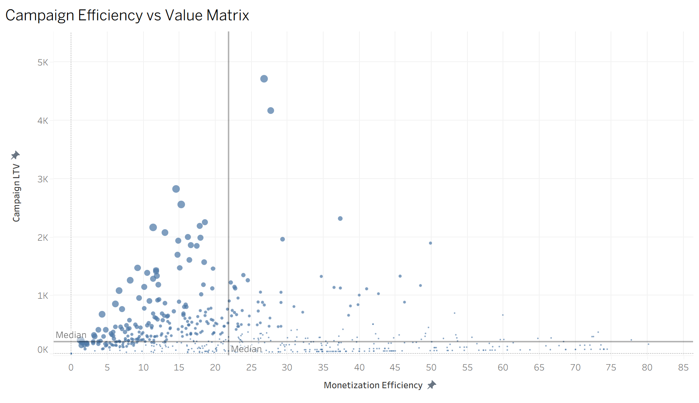
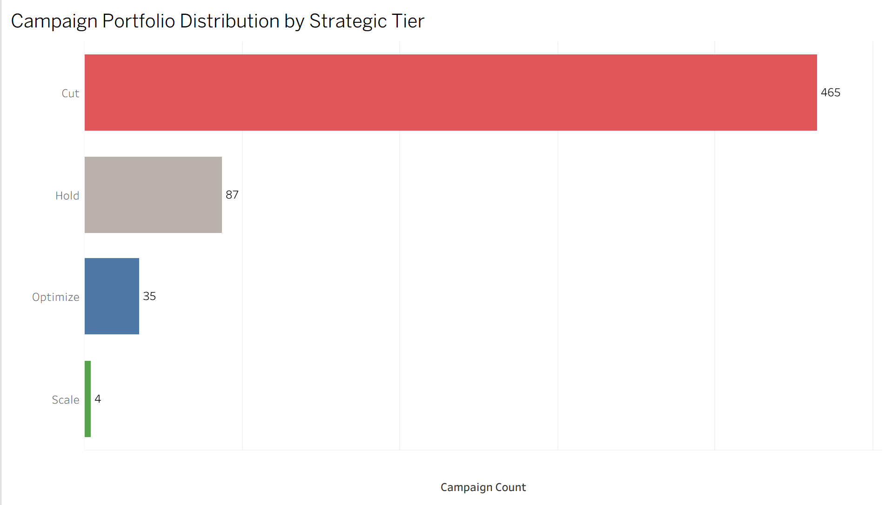
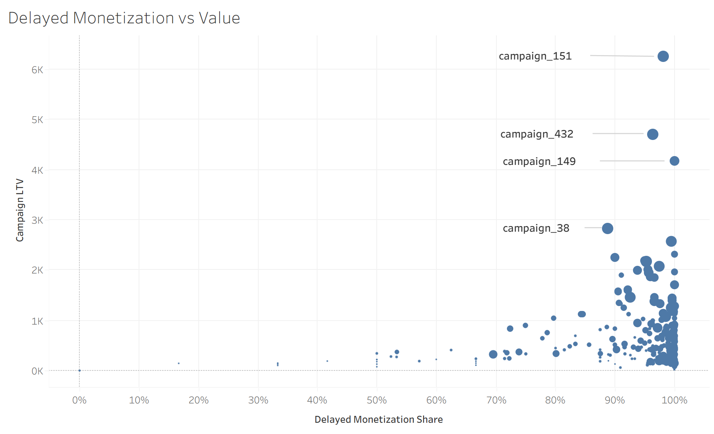

# Facebook Campaign Revenue Analytics

A campaign-level analytics case built from real Facebook Ads data, evaluating how paid acquisition translates into revenue and observed customer value across multiple monetization windows. The project identifies not only which campaigns generate conversions, but which acquisition sources produce stronger monetization quality, delayed revenue generation, and higher observed value per payment event.

## Key Results

- 3,155 validated records analyze
- 591 unique campaign entities
- Top ~40% of campaigns account for approximately 80% of observed LTV
- Only 4 campaigns classified as Scale candidates
- Top-value campaigns showed 90–100% late LTV share


## Live Dashboard

Interactive Tableau visualization:

[**➜ View Interactive Dashboard**](https://public.tableau.com/app/profile/d.s6530/viz/campaign_revenue_dashboard/Dashboard)


## Business Problem

Paid acquisition campaigns differ not just in volume, but in the quality of monetization they produce. Raw payment counts can mask weak value generation, while lower-volume campaigns may deliver disproportionate LTV.

This project addresses the need to move beyond surface-level performance metrics and build an analytical framework that answers: **which campaigns are worth scaling, optimizing, holding, or cutting, and why?**


## Dataset Overview

| Attribute | Detail |
| - | - |
| **Source** | Facebook Ads, single advertising account |
| **Initial rows** | 3,164 |
| **Duplicates removed** | 9 |
| **Final analytical records** | 3,155 |
| **Unique campaign entities** | 591 |
| **Monetization windows** | Day 0 / Day 3 / Day 7 |
| **Spend data** | Not available |

> **Note:** Validation indicated that Day 0, Day 3, and Day 7 fields should be treated as **independent monetization windows** rather than cumulative values. This makes monetization timing a core analytical dimension: same-day metrics alone can significantly underestimate campaign quality.


## Analytical Goals

- Evaluate monetization timing across three independent reporting windows
- Identify revenue concentration patterns across the campaign portfolio
- Classify campaigns by monetization efficiency and observed value quality
- Detect campaigns with strong delayed LTV that would be misclassified by Day 0 metrics alone
- Build a strategic segmentation framework for portfolio-level decision making


## Tech Stack

| Tool | Purpose |
| - | - |
| **PostgreSQL** | Data import, KPI layer, campaign ranking, revenue concentration analysis, segmentation |
| **Excel** | Data validation, duplicate removal, exploratory pivot analysis |
| **Tableau Public** | Interactive dashboard and visualization layer |
| **SQL** | Analytical queries, derived metrics, segmentation logic |


## KPI Framework

### Monetization Metrics

| Metric | Description |
| - | - |
| `payments_0d` | Payment events recorded in the Day 0 window |
| `payments_3d` | Payment events recorded in the Day 3 window |
| `payments_7d` | Payment events recorded in the Day 7 window |
| `ltv_0d` | Revenue / LTV generated in the Day 0 window |
| `ltv_3d` | Revenue / LTV generated in the Day 3 window |
| `ltv_7d` | Revenue / LTV generated in the Day 7 window |

### Derived Metrics

| Metric | Formula | Interpretation |
| - | - | - |
| `payments_total` | `payments_0d + payments_3d + payments_7d` | Total payment events across all observed windows |
| `ltv_total` | `ltv_0d + ltv_3d + ltv_7d` | Total observed revenue / LTV across all windows |
| `late_payment_share` | `(payments_3d + payments_7d) / payments_total` | Share of payment events occurring after Day 0 |
| `late_ltv_share` | `(ltv_3d + ltv_7d) / ltv_total` | Share of revenue / LTV generated after Day 0 |
| `monetization_efficiency` | `ltv_total / payments_total` | Average observed LTV generated per payment event |

`monetization_efficiency` is expressed in absolute value terms, not as a percentage. For example, a value of `20` means that each payment event generated, on average, 20 units of observed LTV.

Higher `monetization_efficiency` indicates stronger value generated per payment event. High payment volume with low efficiency may signal weak monetization quality. `monetization_efficiency` should not be interpreted as a standalone measure of campaign success. Since spend, CAC, ROAS, margin, and user-level retention data are unavailable, this metric is used as a proxy quality indicator. It helps compare how much observed LTV is generated per payment event, but campaign scaling decisions should be validated with acquisition cost data.


## Project Workflow

**1. Data Validation and Normalization**  
Standardized naming conventions, removed 9 duplicate records, validated reporting window structure, and performed exploratory pivot analysis in Excel.

**2. SQL Analytical Layer**  
Built PostgreSQL import workflow, KPI calculation layer, campaign ranking logic, revenue concentration analysis, and campaign segmentation model.

**3. Revenue Concentration Analysis**  
Ranked campaigns by total LTV contribution, calculated cumulative revenue share, and evaluated revenue concentration across the portfolio.

**4. Delayed Monetization Analysis**  
Identified campaigns driven by delayed payment and delayed LTV behavior, compared immediate vs. delayed value generation, and evaluated timing patterns across high-value campaigns.

**5. Dashboard Development**  
Combined all analytical views into a single Tableau dashboard covering revenue concentration, efficiency matrix, strategic segmentation, and delayed monetization behavior.


## Dashboard Overview



The Tableau Public dashboard integrates four analytical views into a single business decision layer: revenue concentration, monetization efficiency, delayed monetization behavior, and campaign strategic segmentation. It is designed for portfolio-level review and prioritization.


## Visualization Analysis

### Campaign Revenue Concentration Analysis



Campaigns were ranked by total observed LTV contribution, and cumulative revenue share was plotted to reveal concentration structure. The curve shows an uneven revenue concentration pattern: **the top ~40% of campaigns account for approximately 80% of total observed LTV**, while the remaining ~60% collectively contribute less than 20%.

This implies that prioritization efforts should focus on the stronger part of the campaign portfolio rather than treating all campaigns as equally valuable.


### Campaign Efficiency vs Value Matrix



Each campaign is plotted on two dimensions simultaneously: Monetization Efficiency on the X axis and Campaign LTV on the Y axis. This creates a four-quadrant strategic classification:

| Quadrant | Criteria | Action |
| - | - | - |
| **Scale** | High efficiency + high LTV | Prioritize for further validation and potential scaling |
| **Optimize** | Lower efficiency but strong value opportunity | Improve monetization quality before scaling |
| **Hold** | Stable moderate performance | Monitor, no immediate action |
| **Cut** | Low value + weak efficiency | Deprioritize or remove |

Most campaigns cluster in low-value zones. A smaller subset enters the Scale and Optimize quadrants, confirming that raw payment volume alone is insufficient for prioritization decisions.


### Campaign Portfolio Distribution by Strategic Tier



| Tier | Campaign Count |
| - | - |
| 🔴 Cut | 465 |
| ⚪ Hold | 87 |
| 🔵 Optimize | 35 |
| 🟢 Scale | 4 |

**465 campaigns** fall into the Cut tier, the largest segment by count and a source of operational noise in the portfolio. Only **4 campaigns** reach Scale-level classification. This distribution is consistent with the revenue concentration analysis: a smaller subset of campaigns drives a disproportionate share of observed business value.


### Delayed Monetization vs Value



This chart plots Late LTV Share on the X axis against Campaign LTV on the Y axis, with bubble size representing total payment volume. The observed pattern suggests that **most high-value campaigns cluster at late LTV shares of 90–100%.**

Top campaigns exhibiting this pattern:

| Campaign | Observation |
| - | - |
| `campaign_151` | Highest LTV in dataset; near-total late LTV share |
| `campaign_432` | Second highest LTV; similarly delayed value structure |
| `campaign_149` | Strong LTV; high late LTV share |
| `campaign_38` | Notable LTV with delayed monetization dependency |

Evaluating campaigns on Day 0 metrics alone would likely misclassify these as weak performers. **Monetization timing is not a secondary signal. It is a core analytical dimension.**


## Key Findings

- **Revenue is unevenly distributed.** The top ~40% of campaigns account for approximately 80% of total observed LTV, while the rest form a long tail of lower-value campaigns.
- **Late LTV dominates high-value behavior.** Top campaigns are heavily dependent on Day 3 and Day 7 value generation. Day 0 metrics systematically underestimate their value.
- **Volume and value do not always align.** High payment volume does not necessarily imply high LTV per payment event. Monetization efficiency provides a better quality signal than payment count alone.
- **Reporting window structure matters.** Treating Day 0, Day 3, and Day 7 as independent windows changed the interpretation of timing-based metrics.
- **Only 4 campaigns qualify as Scale candidates** out of 591 unique campaign entities, reflecting the concentration of acquisition quality in a small subset of the portfolio.
- **Creative reuse alone does not guarantee stable performance.** Reused creative structures should be evaluated independently through campaign-level value, efficiency, and timing metrics.


## Business Recommendations

**Scale**  
Campaigns with high monetization efficiency, strong LTV, and significant late LTV share should be prioritized for further validation and potential scaling.

**Optimize**  
Campaigns with strong value opportunity but weaker monetization efficiency should be reviewed for quality bottlenecks. Improve monetization structure before increasing budget.

**Hold**  
Campaigns with stable moderate performance should remain under monitoring. No immediate action is required unless their value, efficiency, or timing indicators change.

**Cut**  
Campaigns with weak value generation and low efficiency should be deprioritized or removed. Budget and operational attention should be reallocated toward Scale and Optimize candidates.


## Limitations

- No spend data available, so ROAS and CAC metrics cannot be calculated
- No user-level behavioral data, so the analysis operates at campaign aggregation level only
- Reporting windows are limited to Day 0, Day 3, and Day 7
- Single advertising account, so findings may not generalize across accounts or industries
- Campaign scaling recommendations are directional because acquisition cost data is unavailable
- LTV values are treated as monetary value units, but the dataset does not specify the underlying currency or whether LTV represents gross revenue, net revenue, or profit-adjusted value


## Deliverables

- ✅ Cleaned and validated dataset
- ✅ PostgreSQL import workflow
- ✅ SQL analytical queries covering KPIs, ranking, revenue concentration analysis, and segmentation
- ✅ Tableau interactive dashboard
- ✅ Tableau Public visualization
- ✅ Business recommendation framework
- ✅ KPI definitions and derived metric documentation


## Repository Structure

```text
campaign-revenue-analytics/
│
├── data/
│   ├── raw/                  # Original Facebook Ads export
│   └── processed/            # Cleaned, deduplicated analytical dataset
│
├── sql/                      # PostgreSQL queries: KPIs, revenue concentration, segmentation
│
├── tableau/                  # Tableau workbook file
│   └── campaign_revenue_dashboard.twb
│
├── images/                   # Visualization exports used in README
│
└── README.md
```


*Built as a portfolio analytics project demonstrating end-to-end workflow: data validation → SQL analytical layer → revenue concentration analysis → strategic segmentation → Tableau dashboard.*

